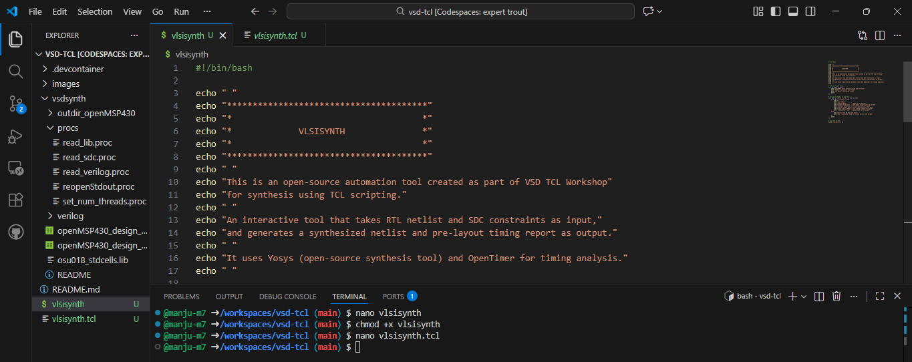

# VSD_TCL_PROGRAMMING_WORKSHOP

## DAY 1: Creating a TCL command and pass .csv file from UNIX shell to TCL script

## Objective

The goal of this day is to **understand how a TCL-based automation flow can process design data from an Excel/CSV input**,synthesize it using **Yosys**, and perform **timing analysis with OpenTimer** - all wrapped inside the **VSDSYNTH Toolbox**.

